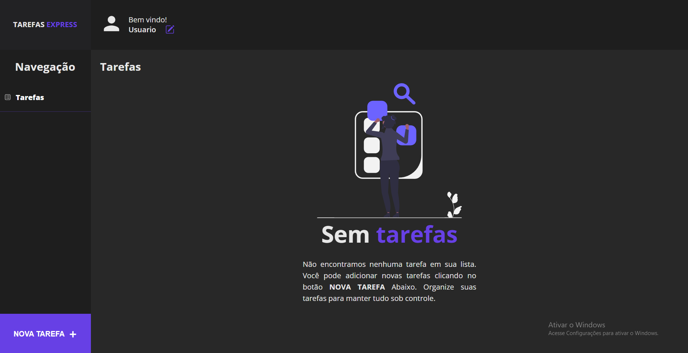

# Projeto de Notas em React
<h1 align="center">
    
</h1>
<h1>👉<a href="https://tarefaexpress.vercel.app" target="_blank">Projeto em Ação</a></h1>

## 📕 Introdução
O projeto de Notas em React é uma aplicação desenvolvida para gerenciar notas e tarefas de forma simples e eficiente. Este documento fornece uma visão geral do projeto, estrutura de diretórios, configurações e funcionalidades principais.

## 📘 Estrutura de Diretórios
components: Contém os componentes React utilizados na aplicação.

Header.js: Componente para o cabeçalho da aplicação.

Main.js: Componente principal para exibição das notas.

Modal.js: Componente para exibição de modais na aplicação.

ButtonNote.js: Componente para adicionar novas notas.

LinkPages.js: Componente para navegação entre páginas.

img: Diretório para armazenamento de imagens utilizadas na aplicação.

## 📗 Configuração e Dependências
O projeto utiliza React para a construção da interface de usuário. 

Clone este repositório em sua máquina local.

No diretório do projeto, execute npm install para instalar as dependências.

Execute npm start para iniciar a aplicação localmente.

Acesse a aplicação no seu navegador em localhost.

## 📃 Funcionalidades Principais
### Cabeçalho (Header)
O cabeçalho exibe o nome do usuário e fornece um botão para modificar o nome.

### Página Principal (Main)
A página principal exibe as notas e tarefas do usuário. Ele permite a visualização, edição e exclusão das notas.

### Modais (Modal)
Os modais são usados para adicionar e modificar notas. Eles fornecem campos de entrada e botões para confirmar a ação.

### Adição de Notas (ButtonNote)
O botão de adição de notas permite ao usuário abrir o modal para adicionar uma nova nota.

## 📖Conclusão
O projeto de Notas em React é uma aplicação simples e eficaz para gerenciamento de notas e tarefas. Pode ser expandido com mais funcionalidades, como categorização de notas, lembretes, entre outros recursos.

## Contato do Desenvolvedor
- Nome: Marcelo Augusto

- Email: sjsjsjmarcelo@gmail.com
- LinkedIn: [linkedin.com/in/marcelo-augusto](https://www.linkedin.com/in/marcelo-augusto-8bb411271/)
- GitHub: [github.com/MarceloAugusto33](https://github.com/MarceloAugusto33)

Sinta-se à vontade para entrar em contato para mais informações ou colaborações.

